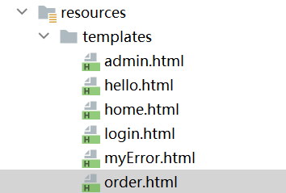

## springsecuriy入门案例-UserDetailsService

#### 一、认证流程

使用UserDetailsService进行springsecurity的用户认证，本篇使用session非token。

首先我们看一下springsecurity的的认证流程。

1.**发起请求:**小明从浏览器登录一个网站，此时发送一个携带着用户名和密码的请求。

2.**获取请求:**请求被Authentication接口的实现类UsernamePasswordAuthenticationToken获取，并被封装为Authentication，并将Authentication提交至认证管理器（AuthenticationManager）进行认证 。

3.**选取认证Provider：**AuthenticationManager使用默认的DaoAuthenticationProvider实现认证。(DaoAuthenticationProvider为AuthenticationProvider的实现类，如果自己要自定义身份验证，自己实现AuthenticationProvider或许更好)。

4.**认证流程1(获取用户名密码):**在DaoAuthenticationProvider中，根据 UsernamePasswordAuthenticationToken获取的username，然后调用 UserDetailsService 检索用户详细信息。

5.**认证流程2(根据用户名查出信息):**UserDetailsService是一个接口，我们需要实现它，只需实现其唯一的方法loadUserByUsername()，在loadUserByUsername()方法中根据用户名从数据库查询用户信息，包括密码和权限，最后将用户名，密码和权限封装在内部可识别的UserDetails对象中，并返回。

6.**认证流程3(与数据库的密码检验):**在DaoAuthenticationProvider，调用additionalAuthenticationChecks 密码认证方法。

7.**认证流程4(填充权限):**密码验证成功后，将从数据库查到的权限填充至Authentication对象中，并返回Authentication对象(权限信息， 身份信息，细节信息，但密码通常会被移除)。

8.**放入容器:**SecurityContextHolder 安全上下文容器将填充了信息的 Authentication ，通过 SecurityContextHolder .getContext().setAuthentication(…)方法，设置到其中。

9.**放入session:**当登录请求处理完毕后，Spring Security 会将 SecurityContextHolder 中的数据拿出来保存到 Session 中，同时将 SecurityContexHolder 中的数据清空。以后每当有请求到来时，Spring Security 就会先从 Session 中取出用户登录数据，保存到 SecurityContextHolder中。

#### 二、案例

##### 1.依赖

```xml
<dependency>
    <groupId>org.springframework.boot</groupId>
    <artifactId>spring-boot-starter-security</artifactId>
</dependency>
```

##### 2.配置SecurityConfig

springsecurity的核心文件就是SecurityConfig

```java
@Configuration
@EnableWebSecurity //开启Security
@EnableGlobalMethodSecurity(prePostEnabled = true) //方法级别的安全认证
public class SecurityConfig extends WebSecurityConfigurerAdapter {


    @Resource
    private SysUserService sysUserService;

    @Bean
    public PasswordEncoder passwordEncoder() {
        return new BCryptPasswordEncoder();
    }

    //重写configure配置,将我们自己的校验密码器注入到该bean中
    @Override
    protected void configure(AuthenticationManagerBuilder auth) throws Exception {
        auth.userDetailsService(sysUserService).passwordEncoder(passwordEncoder());
    }

    @Override
    protected void configure(HttpSecurity http) throws Exception {
        http
                .formLogin() //下面是表单提交的配置
                .loginPage("/login") //指定登陆页面
                .loginProcessingUrl("/doLogin")//制定表单提交的请求地址
                .successForwardUrl("/home")//登录成功跳转页面
                .failureForwardUrl("/myError") //登录失败跳转页面
                .usernameParameter("username") //前端用户名的name属性，不设置默认是username
                .passwordParameter("password")//前端密码的name属性，不设置默认是password
                .and()
                .logout() //以下为注销设置
                .logoutUrl("/logout")
                .logoutSuccessUrl("/login")
                .and()
                .authorizeRequests() //下面的都是授权的配置
                .antMatchers( "/login", "doLogin").permitAll()//访问此地址就不需要进行身份认证了
                .antMatchers("/admin").hasAnyAuthority("admin,manager")
            	.antMatchers("/order").hasRole("order")
                .antMatchers("/hello").anonymous() //未登录的可以访问,登录的不可以
                .anyRequest() //任何请求
                .authenticated() //访问任何资源都需要身份认证
                .and()
                .csrf().disable(); // 禁用 Spring Security 自带的跨域处理

    }


}
```

- 通过继承WebSecurityConfigurerAdapter开启配置

- 注解@EnableWebSecurity和@EnableGlobalMethodSecurity

> @EnableWebSecurity开启springsecurity配置，让其生效
>
> @EnableGlobalMethodSecurity(prePostEnabled = true)方法级别的安全认证
>
> prePostEnabled = true 会解锁 @PreAuthorize 和 @PostAuthorize 两个注解。从名字就可以看出@PreAuthorize 注解会在方法执行前进行验证，而 @PostAuthorize 注解会在方法执行后进行验证。
>
> 例：*@PreAuthorize("hasRole('ADMIN')") 必须拥有 ROLE_ADMIN 角色*

- 重写核心方法

***configure(HttpSecurity http)***

该方法主要是拦截的作用，从三个反面入手

**表单登录**

> http
>                 .formLogin() //下面是表单提交的配置
>                 .loginPage("/login") //指定登陆页面
>                 .loginProcessingUrl("/doLogin")//制定表单提交的请求地址
>                 .successForwardUrl("/home")//登录成功跳转页面
>                 .failureForwardUrl("/myError") //登录失败跳转页面
>                 .usernameParameter("username") //前端用户名的name属性，不设置默认是username
>                 .passwordParameter("password")//前端密码的name属性，不设置默认是password

如果不配置会有默认配置，像loginProcessingUrl的默认是/login（此时虽然和登录页面都是/login但一个是get，表单提交是post），如果设置了应与前端表单提交的url一致。

loginPage("/login") 就是指定登录界面，未登录访问不该访问的界面就会被强行跳转至此；

loginProcessingUrl("/doLogin")表单提交的请求，只有该请求springsecurity才会开启登录认证；

其他的功能上面注释都有。

  **注销**

>     
>       http          
>                 .logout() //以下为注销设置
>                 .logoutUrl("/logout")
>                 .logoutSuccessUrl("/login")

logoutUrl("/logout")设置注销请求为/logout,该请求可以让session失效从而退出登录，还可以使用deleteCookies删除指定的cookie。

logoutSuccessUrl("/login")注销成功后重定向页面。

**授权**

>                 .authorizeRequests() //下面的都是授权的配置
>                 .antMatchers( "/login").permitAll()//访问此地址就不需要进行身份认证了
>                 .antMatchers("/admin").hasAnyAuthority("admin,manager")
>                 .antMatchers("/order").hasRole("order")
>                 .antMatchers("/hello").anonymous() //未登录的可以访问,登录的不可以
>                 .anyRequest() //任何请求
>                 .authenticated() //访问任何资源都需要身份认证

authorizeRequests()权限认证

.antMatchers( "/login").permitAll() 以上请求不需要认证就可以访问

.antMatchers("/admin").hasAnyAuthority("admin,manager")有admin，manager权限的可以访问

.antMatchers("/order").hasRole("order") 有order权限可以访问，数据库里用ROLE_order,这里会自动去除ROLE_

.antMatchers("/hello").anonymous() 未登录的可以访问,登录的不可以，用的少

.anyRequest().authenticated() //以上未设置访问任何资源都需要身份认证

> .csrf().disable(); // 禁用 Spring Security 自带的跨域处理

开启后get请求可以正常访问，而post的请求却无法访问。

***configure(AuthenticationManagerBuilder auth)***

该方法是主要进行验证

```java
    protected void configure(AuthenticationManagerBuilder auth) throws Exception {
        auth.userDetailsService(sysUserService).passwordEncoder(passwordEncoder());
    }
```

userDetailsService(sysUserService)装配自定义sysUserService，密码验证前会执行sysUserService下的loadUserByUsername(String s)方法；

passwordEncoder(passwordEncoder()) 采用BCryptPasswordEncoder()加密方式

##### 3.实现UserDetailsService接口

```java
@Service
@Slf4j
public class SysUserService extends ServiceImpl<SysUserMapper, SysUser> implements ISysUserService, UserDetailsService {

    @Autowired
    private SysUserMapper sysUserMapper;

    @Override
    public UserDetails loadUserByUsername(String s) throws UsernameNotFoundException {
        QueryWrapper<SysUser> wrapper = new QueryWrapper<>();
        wrapper.eq("username",s);
        SysUser sysUser = sysUserMapper.selectOne(wrapper);
        if (sysUser == null) {
            throw new UsernameNotFoundException("用户名不存在");
        }
        List<GrantedAuthority> list = AuthorityUtils.commaSeparatedStringToAuthorityList(sysUser.getRole());
        return new User(sysUser.getUsername(),sysUser.getPassword(),list);
    }
}
```

UserDetailsService是一个用于用户数据的DAO，将数据提供给框架内的其他组件。

UserDetailsService接口只有一个方法实现loadUserByUsername(String s)，传进来username的值在此进行处理，查询数据库获取用户信息，封装成userdetails对象交给框架处理，框架进行密码验证等等。

这里用的mybatis-plus与数据库交互，把查询到的信息封装返回。

##### 4.测试

创建六个界面login登录界面，home登录后主界面，admin有admin权限的可以访问，order有order权限的可以访问，myError登录失败跳转界面，hello未登录才可以访问的界面



这里使用thymeleaf模板引擎测试

```xml
<dependency>
    <groupId>org.springframework.boot</groupId>
    <artifactId>spring-boot-starter-thymeleaf</artifactId>
</dependency>
```

处理请求跳转界面

```java
@Controller
public class LoginController {

    @RequestMapping("/login")
    public String toLogin(){
        return "login";
    }

    @RequestMapping("/home")
    public String home(){
        return "home";
    }

    @RequestMapping("/myError")
    public String myError(){
        return "myError";
    }

    @RequestMapping("/admin")
    public String admin(){
        return "admin";
    }

    @RequestMapping("/hello")
    public String hello(){
        return "hello";
    }

    @RequestMapping("/order")
    public String order(){
        return "order";
    }
}
```

用户名：admin

密码：123

测试各个界面访问